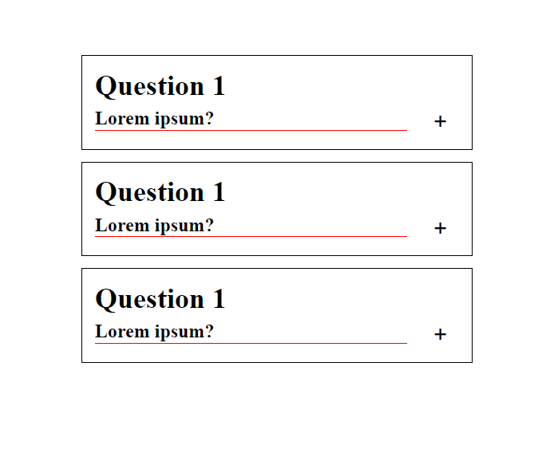
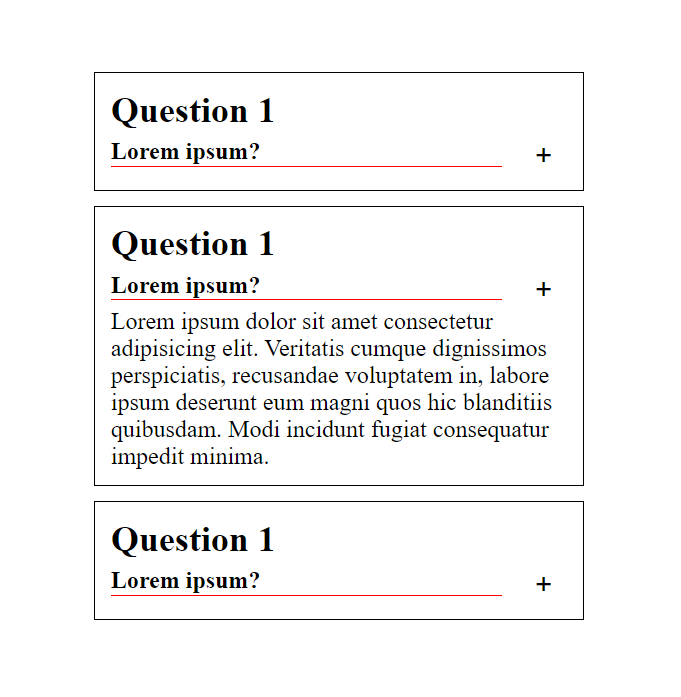

# Description

Collaspsible in Vanila JS and SCSS

# example question

```HTML
<div class="question-box">
<h2>Question 1</h2>
<div class="pytanie">
<h4>Lorem ipsum?</h4>
<button class="rozwin">+</i></button>
</div>

        <p class="invisible">
          Lorem ipsum dolor sit amet consectetur adipisicing elit. Veritatis
          cumque dignissimos perspiciatis, recusandae voluptatem in, labore
          ipsum deserunt eum magni quos hic blanditiis quibusdam. Modi incidunt
          fugiat consequatur impedit minima.
        </p>
      </div>

```

# main logic

```javascript
const rozwin = document.querySelectorAll(".rozwin");
const invisible = document.querySelectorAll(".invisible");

for (let i = 0; i < rozwin.length; i++) {
  rozwin[i].addEventListener("click", () => {
    invisible[i].classList.toggle("visible");
  });
}

// rozwin[0].addEventListener("click", () => {
//   invisible[0].classList.toggle("visible");
// });

// rozwin[1].addEventListener("click", () => {
//   invisible[1].classList.toggle("visible");
// });
```

# Views



